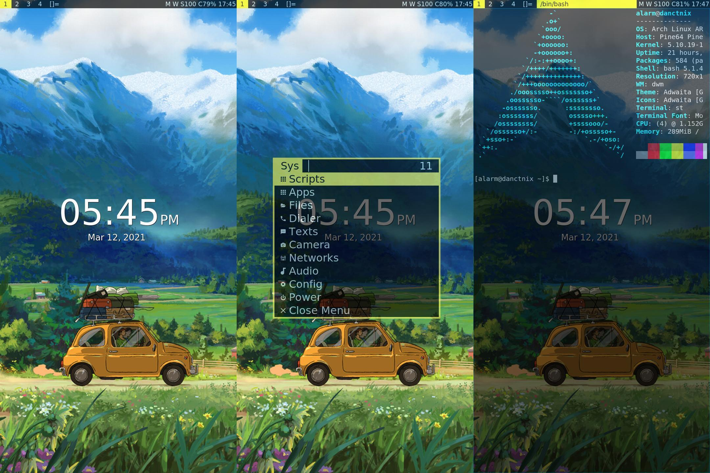

# sxmo-alarm
Script to install [sxmo](https://sr.ht/~mil/Sxmo/) onto an [Arch Arm barebones image](https://github.com/dreemurrs-embedded/Pine64-Arch/releases).
Or you could first use [Danct12 full disk encryption](https://github.com/dreemurrs-embedded/archarm-mobile-fde-installer) to install the barebones image to either eMMC or sdcard.
If this script helps you then please consider buying me a coffee or two ;)

<a href="https://www.buymeacoffee.com/JustineSmithies">Buy me a coffee</a>



The wallpaper is available [here](https://www.artstation.com/artwork/gJPLLx)

## To install and run:

Copy sxmo-alarm somewhere in either the root of your home directory 
or some other directory under your home on your Pinephone and

Then from the directory that you installed it.

```sh
chmod +x sxmo-alarm
```

Then to install leaving the config.h.def files intact each time it's run

```
sudo ./sxmo-alarm
```

Or you can force overwriting the config.h.def files

```
sudo ./sxmo-alarm --force
```

This just displays the options available

```
sudo ./sxmo-alarm --help
```

## Notes: 

Running this script periodically will update sxmo from git.

I've also supplied my .Xresources ( Gives the yellow / black theme ), picom.conf and modified conky.conf .

Also if you do use picom for transparency then it will severely impact the performance of the Megapixels camera to the point of unuseability. Not sure of a workaround as yet ?

If you'd like feedback on keypresses then put this line in your ~/.profile

```sh
export KEYBOARD_ARGS="-o | clickclack -V -f wavfile.wav"

```
Remove the -f and filename if you just want vibration. More details on clickclack are [here](https://git.sr.ht/~proycon/clickclack)


## Issues:

If yay-bin and pacman are giving you grief since recent updates try the following which should fix the issues:

```
sudo pacman -R yay-bin
sudo pacman -Syyuu
rm -Rfv ~/yay-bin
git clone https://aur.archlinux.org/yay-bin.git
cd yay-bin
makepkg -si
```
If your /etc/pacman.conf gets overwritten I have included a copy of my pacman.conf that enables parallel downloads and some eyecandy for updates.

## User Manual:

The user manual is located [here](https://git.sr.ht/~mil/sxmo-docs/tree/master/USERGUIDE.md)
